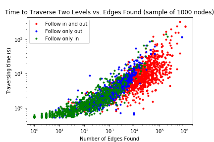
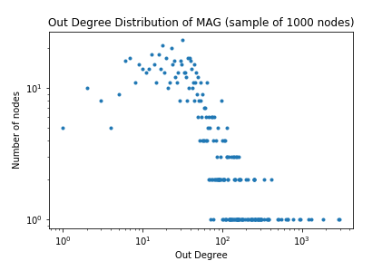
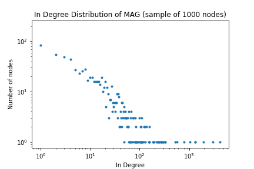

# Introduction

Citation network analysis offers a wealth of information about professional communities and the development of academic research. One common application of this information is to create recommendation systems that can refer readers to other relevant sources. To do so, extensive research has been conducted to craft robust methods that attempt to determine which papers are most important and impactful within a given field.

However, rather than identify papers that are generally popular in a field, in this paper we are concerned with finding papers that are foundational specifically to the development of a single paper at hand. Thus, we aim to build a recommendation system that can discover the papers that have most directly contributed to the knowledge any given paper builds on.

To accomplish this task, recent research has employed methods of citation network analysis in order to examine the evolutionary structure of academic knowledge throughout time. However, such findings are often limited to narrowly-defined scientific concepts and fields [@calero-medinaCombiningMappingCitation2008, @liuIntegratedApproachMain2012, @xiaoKnowledgeDiffusionPath2014], require manual curation of domain-specific citation datasets, and fail to apply to the broader day-to-day inquiries a researcher may have.

Thus, the key contribution of our work is applying methods of network analysis to a large, comprehensive citation dataset, allowing exploration of almost every domain of academia. In order to handle a citation network of this magnitude, we craft algorithms for extracting any paper’s local neighborhood in the citation network in an efficient manner such that recommendations can feasibly be returned to a user interactively. Finally, we apply variations of main path analysis in order to trace the academic lineage for the given paper based on its local neighborhood of citations and references.

Thus, the contributions of our paper extend previous work by abstracting their methods and results to operate on papers from any field, not simply a small subfield, while also removing the need for manual construction of domain-specific datasets. By doing so, we hope to make the evolutionary structure of academic research more accessible for anyone attempting to gain a broad understanding of the development of academic literature.

# Related Work

## Single-Score Methods

There exist many different methods to determine node importance in a graph. For paper and journal importance applications, Clarivate Analytics has published journal importance statistics based on two distinct measures: the Journal Impact Factor, which is mostly based on citation counts [@ImpactFactorClarivate] and the Eigenfactor score [@bergstromEigenfactorMetrics2008], which is essentially a modified PageRank algorithm for citation networks rather than web networks.

While these methods provide effective rankings given the properties they attempt to rank by, they provide nothing but a single score number that can be hard to interpret. Because these scores distill complex graph phenomena into a single number, they offer little help in determining the actual relationships between articles and understanding the larger development of science. Thus, single-score methods do not effectively help researchers with the problem of determining what the foundations of a paper are.

Because of this lack of information from single-score methods, we seek algorithms that preserve the citation network graph structure. Thus, our research pointed us towards the usage of main path analysis, which we will explore more in the next three papers.

## Combining mapping and citation network analysis for a better understanding of the scientific development [@calero-medinaCombiningMappingCitation2008]

Calero-Medina and Noyons combine bibliometric mapping and citation network analysis in order to investigate the development of scientific knowledge about Absorptive Capacity, a term coined in 1988 that has had widespread influence on the field of Organization.

For citation network analysis in particular, they utilize two different methods: 1) main path analysis, and 2) hubs and authorities analysis. Main path analysis identifies the nodes that are most frequently used in “walks” from the most recent citations to the oldest. By computing all such possible paths, we can discover the papers that are more frequently encountered throughout time, pointing towards their centrality in the development of an academic specialization. This technique is combined with information gained from using hubs and authorities analysis, which identifies papers that are both cited by other prominent papers as well as cite important papers themselves.

By combining these different perspectives, Calero-Medina and Noyons successfully identify 15 papers that comprise the main path component of the Absorptive Capacity field. Thus, this paper provides inspiration for using main path analysis to identify foundational papers in combination with hubs and authorities which actually ranks and scores the papers.

## An integrated approach for main path analysis: Development of the Hirsch index as an example [@liuIntegratedApproachMain2012]

Liu and Lu begin by critiquing the technique of main path analysis. The original main path analysis only identifies a single main path, which is not representative of larger scientific networks that often have multiple main paths. Furthermore, the original algorithm greedily constructs the main path by repeatedly selecting the link with the highest search path count (SPC). However, as with many greedy algorithms, this algorithm is not guaranteed to produce the path with the largest cumulative SPC or contain the link with the largest SPC.

Therefore, Liu and Lu propose new variations on main path analysis. For example, global main path analysis aims to find the path with the true overall largest SPC. Another is multiple main path analysis, which identifies multiple local main paths by relaxing the search constraints to reveal more detailed information. Finally, key-route main path analysis guarantees that the link with the highest SPC is included by beginning the search from both ends of the link instead of the source nodes. Importantly, all of these methods can be combined as well.

Thus, the authors next apply an integrated approach that utilizes a combination of main path analysis methods in order to examine the development of the Hirsch index. Ultimately, their results prove that the main path analyses developed by Liu and Lu enhance our capability to capture different types of information about the relationships between scientific articles.

## Knowledge diffusion path analysis of data quality literature: A main path analysis [@xiaoKnowledgeDiffusionPath2014]

In this article, Xiao et al. integrate local, global, multiple-global, and key-route main path analyses to uncover knowledge diffusion paths of data quality literature. In particular, they demonstrate that each type of main path analysis reveals different yet complementary information about development trends.

For example, local and global main path analysis highlight the papers that have provided major contributions to the field. On the other hand, multiple global and the key-route main path analyses provide more complete pictures of development trends by identifying multiple paths, revealing the divergence-convergence of the citation network as it evolves throughout time.

Finally, and perhaps most importantly, Xiao et al. also provide intuitive graphical representations of main path analyses in order to both convey their nuances and allow the reader to view the interrelationships between papers. This method of presenting results in particular serves as an inspiration for our project.

## Motivation for Improvement

As seen from the literature review above, citation network and main path analysis are often limited to characterizing the development structures of specific concepts and subfields such as Absorptive Capacity, the Hirsch Index, and data quality literature.

This reality proves less than ideal for researchers and academics, who are told to “stand on the shoulders of giants” but are not given any tools that they can use to efficiently peruse and explore the development of their field. For example, conducting a literature review requires the ability to determine what works constitute essential background reading for a given paper, as well as assessing works with large impact when attempting to create new innovational methods.

However, this is not an easy process, as making literature reviews is a time-consuming manual problem that consists of recursively searching through papers’ citations to try to understand what actual authorities and ground truths underlie a research problem. Beyond even just academics, people with casual interest in a field should also be able to have easy access to a field’s literature without having to manually search for its most foundational papers. Such tasks would benefit from comprehensive knowledge of the development of the techniques and concepts under question.

# Dataset

While there are many options for citation networks, for this project we selected the Microsoft Academic Graph (MAG)[@sinhaOverviewMicrosoftAcademic2015]. We chose this dataset because it is [freely available under an open license](https://docs.microsoft.com/en-us/academic-services/graph/get-started-setup-provisioning#open-data-license-odc-by), and it has also been described as "the most comprehensive publicly available dataset of its kind" in a review article [@herrmannovaAnalysisMicrosoftAcademic2016].

We initially chose the 2017 snapshot of the MAG [made available by the Open Academic Society](https://www.openacademic.ai/oag/), however, the IDs assigned to papers in that dataset do not match those used by the [Microsoft Academic API](https://labs.cognitive.microsoft.com/en-us/project-academic-knowledge), meaning that looking up paper titles from IDs required a local copy of the entire uncompressed dataset which totalled 300GB.

Thus, we instead contacted Microsoft and got access to a recent snapshot (accurate as of 2018-10-12) of the current MAG. We then downloaded only the [PaperReferences](https://docs.microsoft.com/en-us/academic-services/graph/reference-data-schema#paperreferencestxt) file, which is a 31.3 GB edge list, where paper IDs are 64-bit integers.

# Inexpensively Constructing Local Neighborhoods

## Motivation

As explained above, due to its large, comprehensive dataset of citations, we utilize the Microsoft Academic Graph (MAG) as our principal citation network in order to be able to apply our methods to any paper within the MAG. However, using the MAG poses a challenge due principally to the large size of the dataset.

The MAG contains an edge list of 1,269,744,602 edges, each consisting of two 64-bit integer ids. Consequently, fitting the whole edgelist in memory would require a machine with at least 22 GB of RAM, plus more RAM for auxiliary data structures. Given the limited nature of the computing hardware available (laptops with 8GB of RAM and compute credits for cloud instances with 4GB of RAM), we could not simply load the dataset into memory and perform a typical breadth-first search.

Thus, we devised a system to quickly run breadth-first search such that we minimize lookups to the edge list on the HDD or SSD while minimizing memory usage. This work follows a similar vein as GraphChi [@kyrolaGraphChiLargeScaleGraph] or X-Stream [@royXStreamEdgecentricGraph2013], but specifically designed for the specific task of subgraph partitioning rather than more general graph computation frameworks. Notably, this algorithm still makes the assumption that while the whole graph cannot fit in RAM, a given paper’s subgraph can.

## Method

Our method has two distinct phases: hashing and traversal. In the hashing step, we create two indexes by hashing edges to files based on the source node id for the first and the destination node id for the second. This method is similar to the “shard” method employed by GraphChi as each shard contains a number of edges that can can be fully loaded into memory. However, to simplify implementation, we hashed to separate files, rather than sorting the list into shards.

\begin{algorithm}
\SetKwInOut{Input}{Input}
\SetKwInOut{Output}{Output}

    \underline{function hashEdgeList}  \;
    \Input{sourceFile, numberHashFiles}
    \Output{srcHashFolder, dstHashFolder}
    \For{line$\gets$sourceFile}{
       srcID, dstID $\gets$ line \\
       srcHashNumber $\gets$ srcID \% numberHashFiles \\
       dstHashNumber $\gets$ dstID \% numberHashFiles \\
       srcHashFolder/\$\{srcHashNumber\} $\gets$ line \\
       dstHashFolder/\$\{dstHashNumber\} $\gets$ line \\
     }
    \caption{Hash edge list into two files}

\end{algorithm}

Once we have pre-processed and hashed the data, we can use that data structure to traverse the graph in pieces.

\begin{algorithm}
\SetKwInOut{Input}{Input}
\SetKwInOut{Output}{Output}

    \underline{function BFSOutLinks}  \;
    \Input{initialPaperID, levels}
    \Output{outputFile}
    seenPapers = \{\} \\
    seenPapers.Add(initialPaperID) \\
    currentPapers = \{\} \\
    currentPapers.Add(initialPaperID) \\
    \For{$i\gets0$ \KwTo levels}{
      nextPapers = \{\} \\
      \For{i $\in$ currentPapers}{
        hashNumber $\gets$ id \% numberHashFiles \\
        \For{line$\gets$srcHashFolder/\$\{hashNumber\}}{
           sourceID, destinationID $\gets$ line \\
           \uIf{sourceID $\in$ currentPapers $\land$ $\neg$ sourceID $\in$ seenPapers}{
             seenPapers.Add(destinationID) \\
             nextPapers.Add(destinationID) \\
             outputFile $\gets$ line \\
           }
        }
      }
    }
    \caption{Preform a traversal over the hashed graph}

\end{algorithm}

The BFS maintains a set of currentPapers and of seenPapers. The currentPapers set keeps track of all the starting points for the next level of BFS and is cleared at the end of each level. The seenNodes set contains all nodes previously seen by the BFS. Thus, this set results on the majority of memory use for the algorithm. We write edge lines directly out to the output edgelist file as soon as they are matched as an edge that connects with a paper in the currentPaper set. Thus, this algorithm holds very little state in memory and notably does not hold a representation of the subgraph in memory.

Because of our hash setup, we are guaranteed that all of the edges from a node are in a single file, thus finding all the out edges for a node requires reading only one of the hashed files, which are much smaller than the original file, depending on the number of hash files chosen. We chose to make 3000 hash buckets and our files ended up around 9.5 MB each. This simple setup vastly decreases the amount of IO needed to traverse the graph and typical runs going out 2-3 levels only require less than 15GBs of disk IO on the 30GB dataset, as measured by the OS activity monitor. This reduction of IO operations is the key to the performance of this technique as these workloads are almost entirely IO-bound. Even with this technique our server instance (an inexpensive Azure DS1 1-CPU instance), runs at around 30% CPU while performing a traversal.

When planning for larger runs of the BFS, we realized that we could end up with more seenNodes than we had memory for if the traversal grows too large. To handle this, we tested an inverse bloom filter [@OppositeBloomFilter2012, @treatProbabilisticDataStructures2018]. This variation of a classic Bloom Filter provides a constant-memory way of checking which nodes have already been seen in such a way that there are no false positives and the filter never reports that we’ve seen a node when we haven’t at the expense of sometimes falsely reporting a node as not seen. This means that we get a correct count for nodes, while some edges are repeated. While we validated this method on a few papers, more work would be needed to characterized the performance and correctness of this method.

## Runtime Analysis of BFS

We performed an empirical performance analysis of our breadth-first search methods. While calculating node degrees, we logged the time each run took and compared that to the number of edges found in the subgraph. We ran breadth-first searches on 1000 randomly selected nodes for one level (to get in and out degrees, see next section) and for two levels. At each level we did three runs, one following both in and out links, one following only in links and one following only out. The results of this are in graph form below:

## MAG Statistics

Using the breadth-first search tool described above, we calculated approximate in and out degree distributions for the MAG using a random sample of 1000 nodes.

The out degree distribution, which represents the number of referenced papers, shows that the vast majority of papers cite under 100 papers; however, a few cite more. This distribution does not follow the same power law distribution commonly seen in community networks, which intuitively makes sense given that it reflects the norms of how many papers authors typically cite, rather than network effects.

The in degree distribution matches up more with a traditional power-law network community degree distribution like that seen in web graphs [@broderGraphStructureWeb2000]. This makes intuitive sense as the mechanisms that govern who interacts with a website by linking it and who interacts with an academic work by citing it seem very similar.

# Finding Development Trends in Academic Research

In this paper, we evaluate various methods for reconstructing the development of academic research. We examine methods utilizing single-score centrality-based methods such as PageRank and node betweenness, as well as variants of main path analysis.

## Baselines: Single-Score Importance

### PageRank

The famous PageRank algorithm [@pagePageRankCitationRanking1998] utilizes the intuition that important nodes in a graph are both linked to by other important nodes as well as themselves link to other important nodes. The PageRank equation for any given node is:

$$ r*{j} = \sum*{i \rightarrow j} \beta \frac{r_i}{d_i} + (1 - \beta) \frac{1}{n} $$

Starting from the given paper, we greedily choose the next node with the highest PageRank score for our main path. It is worth noting that this is not the typical use case for PageRank, which would most likely give stronger results if it simply returned the nodes with the highest PageRank scores in the subgraph. However, doing so would not construct a direct lineage of research development from the source paper. In other words, in order to compare latter main path analysis methods with our baselines, we must compare lineages with lineages, instead of lineages with top five raw values.

### Node Betweenness

The betweenness centrality for node is the probability that a shortest path passes through it. This measure captures the influence of a node over the flow of information between other nodes [@girvanCommunityStructureSocial2002], and thus may prove especially fruitful for discovering the lineage of academic knowledge. A node’s betweenness centrality can be calculated using:

$$c*{bet}(x) = \sum*{y, z \neq x, \sigma*{yz} \neq 0} \frac{\sigma*{yz}(x)}{\sigma\_{yz}}$$

where $\sigma*{yz}$ is the number of shortest paths going from $y$ to $z$, and $\sigma*{yz}(x)$ is the number of such paths that pass through $x$.

Starting from the given paper, we greedily choose the next node with the highest node betweenness centrality for our main path.

## Main Path Analysis

Main path analysis is a network analysis method commonly used to find knowledge diffusion structures in research fields through identifying a series of connected nodes with the maximum connectivity [@xiaoKnowledgeDiffusionPath2014]. Main path analysis consists of two major algorithmic components: computing edge traversal counts and path search.

### Traversal Counts: Search Path Count

There are many different types of edge traversal counts commonly used with main path analysis, such as Search Path Count (SPC) and Search Path Link Count (SPLC). Most of these types yield similar results in practice, but previous literature suggests that search path count (SPC) provides additional favorable properties and therefore was the most preferred and widely used [@xiaoKnowledgeDiffusionPath2014].

Thus, we adopt SPC as our first type of traversal count. Notably, this choice required implementing SPC from scratch in Python, as there were no previous implementations that were easily accessible and compatible with SNAP.

The SPC value for a given edge is the number of times it is traversed during all possible paths from source to destination nodes. Manually computing all possible paths in a graph is computationally expensive, but fortunately Batagelj [@batageljEfficientAlgorithmsCitation2003] devised an efficient algorithm to compute the SPC values of all edges in $O(\text{\# of edges})$ time.

Using the same notation as Batagelj, let $aRb$ represents an edge from node $a$ to $b$. We define two new quantities:

$$N^{-}(u) = \begin{cases}
1, & u = s \\
\sum\_{v:vRu} N^{-}(v), & \text{otherwise} \\
\end{cases} $$

Where $N^{-}(u)$ denotes the number of paths from the source node $s$ to node $u$.

$$ N^{+}(u) = \begin{cases}
1, & u = t \\
\sum\_{v:vRu} N^{+}(v), & \text{otherwise} \\
\end{cases} $$

Where $N^{+}(u)$ denotes the number of paths from v to a destination node $t$ (nodes with no out-links).

### Cycles in the Citation Network

In theory, citation networks are DAGs. However, anomalies in the dataset (i.e., revisions to papers after publishing) prevent real world citation networks from being acyclic. This has negative consequences on SPC in particular, which requires the graph to be acyclic.

Unfortunately, detecting and removing all cycles in a graph is extremely expensive. To try and mitigate the effects of cycles, we create a validation method that resolves all bidirectional edges between any pair of nodes. To do so, we utilize MAG API requests to compare the dates of the two nodes and remove the edge from the older paper to the newer paper.

While this validation improves performance of SPC, it still does not remedy the situation completely. For this reason, we turn towards a second method of computing edge weights.

### Traversal Counts: Edge Betweenness

Edge betweenness measures the number of shortest paths passing over a given edge in the graph. This measure specifically gives great weight to edges that connect communities and if removed would most disrupt the graph’s underlying structure. We believe that this measure may apply well to the case of citation networks, in which important papers can serve as centralizing nodes that connect different subfields and related works together. Importantly, to calculate edge betweenness we use SNAP’s built-in method that is robust to cyclic graphs.

### Path Search

Unlike for traversal counts, different path search methods can yield significantly different results. There are three common techniques for constructing the main path: local search, global search and key-route search.

For the purposes of this project, we focus on local search. Starting from the source node (i.e., the paper under consideration), this search greedily follows the edge with the greatest traversal count until it reaches a destination node (i.e., a paper with no out-links in the graph). The papers that the search encountered during its traversal make up the main path, which are then reported as the foundational papers.

Finally, with the list of unique paper IDs identified by main path analysis, we utilize API requests to Microsoft Academic to retrieve the papers’ titles and years. Thus, the final output of the algorithm is a list of papers that are easily human readable and interpretable.

# Evaluation Framework

We devised a quantitative evaluation framework that could characterize our methods and assess their performance. To do this, we framed our methods as a “recommender system” and pitted them against human and algorithmic baselines. In pursuit of this goal, we created the following evaluation framework:

1. Choose a paper from the Microsoft Academic Graph
2. Manually identify the paper’s top five “most foundational papers”
3. Find the recommended foundational papers for each of the baselines and methods outlined above
4. Compare the recommended papers with the ground truth papers and count the number of matches

We implemented this evaluation framework on three papers:

1. node2vec: Scalable Feature Learning for Networks [@groverNode2VecScalableFeature2016]
2. Network Embedding as Matrix Factorization: Unifying DeepWalk, LINE, PTE, and node2vec [@qiuNetworkEmbeddingMatrix2018]
3. Values Are a Good Thing in Conservation Biology [@nossValuesAreGood2007a]

In manually identifying papers, however, we realized the difficulty of the task for a non-expert non-author person to identify lineages or foundational papers. A key aspect of lineages and foundational papers is that they need not be direct citations and also depend heavily on their location within the academic graph. If we find a paper that is both cited cited by every other direct citation of another paper, that paper is likely very foundational, but it is exceedingly difficult for a non-expert reader to identify. We have ideas for how to better frame quantitative analysis of such methods that we discuss in our future work section.

Thus, we decided to reframe our evaluation as qualitative and focus it on identifying key characteristics between different methods and parameters. This analysis must be qualitative because it is hard to define exactly what lineages are and what results are “good”. We focus more on what our methods are doing and what properties of the citation network they seem to be highlighting.

# Results

The following tables show the results of running the evaluation framework on the three aforementioned papers for BFS graphs of 2 levels following only out-links, 2 levels following both out- and in-links, and 3 levels following only out-links were computed.

We have also listed each method’s specific recommendations for each of the three aforementioned papers in the attached appendix.

# Discussion

Looking at the quantitative results, we notice two distinct trends emerge from the data. First, the BFS graph for 2 levels following only out-links has the highest number of total matches for all three papers. We believe this may be due in part to the fact that shorter hop BFS graphs capture more accurately paper-specific neighborhoods, thus emphasizing papers that are of high importance in relation to the source paper.

However, we also acknowledge that this result may be due to a faulty evaluation method. When curating the “ground truth” foundational papers for the three papers in the test set, there is most likely a strong bias towards choosing papers that appear in the given paper’s direct references, as those will be the papers whose ideas are most strongly cited on first read. Thus, the chosen ground truth papers are more biased towards a paper’s direct references rather than its indirect, transitive references, which will serve to bias the methods’ performance to the smaller BFS subgraphs. We will discuss improvements to the evaluation method in the future work section.

Secondly, MPA using SPC achieves the highest number of total matches across all three papers with 9 total matches. This result is promising, even when using a non-robust evaluation metric, and can also be corroborated by the qualitative results (see Appendix). For example, for the paper “Network Embedding as Matrix Factorization: Unifying DeepWalk, LINE, PTE, and node2vec” (Qiu et al., 2018) using the BFS subgraph on two levels following only out-links, the main path constructing using SPC traversal counts captures three of the methods mentioned in the paper title. It further includes papers on representation learning and dimensionality reduction, which are both foundational concepts utilized in the paper. Similar qualitative analysis of the other BFS subgraphs of two levels following only out-links produces similarly strong results.

In comparison, choosing nodes on the main path based on highest PageRank scores performs the worst. This result can be explained in one part by the unconventional use of PageRank in choosing the next node for the main path, as well as by the BFS subgraph sometimes only being constructed on out-links. Furthermore, taking a qualitative look at the PageRank results, it is often derailed from the intuitive “main path” by picking papers that have high importance but are so far removed from the given paper that the link between the two can be hard to interpret. One can see this quantitatively by the fact that the PageRank paths are on average shorter than the paths produced by other methods.

It is worth noting, however, that almost all the methods do not perform as well when used on larger BFS subgraphs or BFS subgraphs that follow in-links. In particular, following in-links proves a difficult challenge as it only requires a few popular papers with hundreds or even thousands of citations to blow up the BFS subgraph dramatically. It was for this reason that a BFS subgraph of three levels following both in- and out-links was not feasible for this paper, as while we could extract the subgraphs successfully (which generally had around 1.5 million to 3 million nodes), the methods would take enormous amounts of time to complete.

Overall, while the results are not definitive in proving that MPA is strictly better than any existing methods, preliminary quantitative and qualitative analysis of the produced paths provides evidence for the potential of MPA using SPC and node betweenness in constructing development trends of academic research. In particular, we show that MPA offers information that is different and complementary to that traditionally provided by citation recommendation systems through its creation of lineages of connected academic works specific to the given paper rather than collections of generally important works in a field.

Furthermore, our paper contributes a novel application of MPA to the MAG, which offers a promise for identifying structures of academia for any field or concept contained in the dataset. Ultimately, we hope to provide one small step forward in the pursuit of increasing accessibility to research and academia for all.

# Future Work

As mentioned above, quantitative evaluation of any methods designed to understand the foundations and lineages of papers must find some representation of a ground truth. However, such ground truth measures are difficult for non-experts to formulate and even define. We believe that there is room for an empirical study to help determine what the ground truth development structures are for certain papers, which would necessitate going to domain experts and surveying them to hear their ideas of what influence a given paper the most.

We anticipate that actually defining “foundational” papers and “lineages” of papers in a consistently-interpreted way will be a challenge. Any study would need to address these vague concepts with clear definitions that could be interpreted in the same manner by the authors surveyed. A study like this would allow for some ground-truth data on what our algorithms should be looking for when we seek to identify foundational papers.

This project is also meant as a starting point for studies of interdisciplinary academic structure that require working with a comprehensive citation network. This opens the door for research that seeks to determine to what extent do different disciplines interact with each other and identify “filter-bubbles” where different disciplines might argue over the same concept without ever interacting with the literature, and academic lineages, of their opponents.

Finally, there remains much potential for improvement of the methods used in this paper. For example, adapting SPC to handle cyclic graphs or applying an efficient method for removing cycles may boost its performance. Additionally, MPA using SPC and edge betweenness tends to produce main paths of long lengths, and thus discouraging this behavior using damping or weighting nodes by their marginal gain (i.e., the number of unique papers they add in a set cover) may help with condensing the results.

# References

# Appendix

This appendix contains the results from constructing paths of academic research from the three papers mentioned in the paper. The four methods utilized were MPA using SPC, MPA using edge betweenness, PageRank, and node betweenness.

Sometimes, the maximum value for the weight of an edge or nodes is 0, in which case the next node in the path is chosen arbitrarily from all the neighbors of the previous node. This case results from failing due to cycles in the graph (i.e., MPA using SPC) or other anomalies. These edges/nodes are denoted in the results with an \*.

## node2vec: Scalable Feature Learning for Networks (Grover & Leskovec, 2016)

### BFS Graph (1395 nodes, 1684 edges): 2 levels, following only out-links

#### Main Path Analyis (SPC)

1. grarep learning graph representations with global structural information (2015)
2. line large scale information network embedding (2015)
3. deepwalk online learning of social representations (2014)
4. representation learning a review and new perspectives (2013)
5. a global geometric framework for nonlinear dimensionality reduction (2000)
6. image representations for visual learning (1996)

#### Main Path Analyis (Edge Betweenness)

1. community detection in graphs (2010)
2. chemical oscillations waves and turbulence (1984)

#### PageRank

1. nonlinear dimensionality reduction by locally linear embedding (2000)
2. learning the parts of objects by non negative matrix factorization (1999)

#### Node Betweeness

1. deepwalk online learning of social representations (2014)
2. representation learning a review and new perspectives (2013)
3. a global geometric framework for nonlinear dimensionality reduction (2000)
4. independent component analysis a new concept (1994)\*

### BFS Graph (1395 nodes, 1684 edges): 2 levels, following only out-links

#### Main Path Analyis (SPC)

1. community detection in graphs (2010)\*
2. random walks markov processes and the multiscale modular organization of complex networks (2014)\*

#### Main Path Analyis (Edge Betweenness)

1. community detection in graphs (2010)
2. the principal components analysis of a graph and its relationships to spectral clustering (2004)
3. laplacian eigenmaps and spectral techniques for embedding and clustering (2001)
4. a global geometric framework for nonlinear dimensionality reduction (2000)
5. perceptual cognitive universals as reflections of the world (1994)

#### PageRank

1. nonlinear dimensionality reduction by locally linear embedding (2000)
2. image representations for visual learning (1996)

#### Node Betweeness

1. community detection in graphs (2010)
2. random walk computation of similarities between nodes of a graph with application to collaborative recommendation (2007)
3. laplacian eigenmaps and spectral techniques for embedding and clustering (2001)
4. normalized cuts and image segmentation (2000)\*

### BFS Graph (19854 nodes, 38148 edges): 3 levels, following only out-links

#### Main Path Analysis (SPC)

1. a large scale evaluation of computational protein function prediction (2013)
2. analysis of protein function and its prediction from amino acid sequence (2011)
3. annotation error in public databases misannotation of molecular function in enzyme superfamilies (2009)
4. protein function prediction the power of multiplicity (2009)
5. network based prediction of protein function (2007)
6. cfinder locating cliques and overlapping modules in biological networks (2006)
7. cytoscape a software environment for integrated models of biomolecular interaction networks (2003)\*

#### Main Path Analysis (Edge Betweenness)

1. community detection in graphs (2010)
2. microscopic evolution of social networks (2008)
3. relational learning via latent social dimensions (2009)
4. using ghost edges for classification in sparsely labeled networks (2008)
5. semi supervised learning literature survey (2006)
6. self taught learning transfer learning from unlabeled data (2007)
7. reducing the dimensionality of data with neural networks (2006)
8. a fast learning algorithm for deep belief nets (2006)
9. justifying and generalizing contrastive divergence (2009)
10. semantic hashing (2009)
11. rcv1 a new benchmark collection for text categorization research (2004)
12. machine learning in automated text categorization (2002)
13. enhanced hypertext categorization using hyperlinks (1998)
14. on the foundations of relaxation labeling processes (1987)
15. relaxation and constrained optimization by local processes (1979)

#### PageRank

1. nonlinear dimensionality reduction by locally linear embedding (2000)
2. dimension reduction by local principal component analysis (1997)
3. replicator neural networks for universal optimal source coding (1995)
4. the wake sleep algorithm for unsupervised neural networks (1995)

#### Node Betweeness

1. community detection in graphs (2010)
2. the structure and function of complex networks (2003)
3. statistical mechanics of complex networks (2001)
4. clustering and preferential attachment in growing networks (2001)
5. the structure of scientific collaboration networks (2001)
6. structural cohesion and embeddedness a hierarchical concept of social groups (2003)
7. models of core periphery structures (2000)
8. optimization by simulated annealing (1983)
9. solvable model of a spin glass (1975)
10. photon cross sections attenuation coefficients and energy absorption coefficients from 10 kev to 100 gev (1969)\*

## Network Embedding as Matrix Factorization: Unifying DeepWalk, LINE, PTE, and node2vec (Qiu et al., 2018)

### BFS Graph (1155 nodes, 1571 edges): 2 levels, following only out-links

#### Main Path Analysis (SPC)

1. network embedding as matrix factorization unifying deepwalk line pte and node2vec (2018)
2. inductive representation learning on large graphs (2017)
3. structural deep network embedding (2016)
4. grarep learning graph representations with global structural information (2015)
5. line large scale information network embedding (2015)
6. deepwalk online learning of social representations (2014)
7. representation learning a review and new perspectives (2013)
8. nonlinear dimensionality reduction by locally linear embedding (2000)

#### Main Path Analysis (Edge Betweenness)

1. network embedding as matrix factorization unifying deepwalk line pte and node2vec (2018)
2. representation learning a review and new perspectives (2013)
3. modeling pixel means and covariances using factorized third order boltzmann machines (2010)

#### PageRank

1. network embedding as matrix factorization unifying deepwalk line pte and node2vec (2018)
2. deepwalk online learning of social representations (2014)
3. efficient estimation of word representations in vector space (2013)
4. linguistic regularities in continuous space word representations (2013)

#### Node Betweenness

1. network embedding as matrix factorization unifying deepwalk line pte and node2vec (2018)
2. deepwalk online learning of social representations (2014)
3. representation learning a review and new perspectives (2013)
4. imagenet classification with deep convolutional neural networks (2012)\*

### BFS Graph (47035 nodes, 55686 edges): 2 levels, following both out-links and in-links

#### Main Path Analysis (SPC)

1. network embedding as matrix factorization unifying deepwalk line pte and node2vec (2018)
2. inductive representation learning on large graphs (2017)
3. community preserving network embedding (2017)
4. node2vec scalable feature learning for networks (2016)
5. grarep learning graph representations with global structural information (2015)
6. line large scale information network embedding (2015)
7. deepwalk online learning of social representations (2014)
8. leveraging social media networks for classification (2011)
9. empirical comparison of algorithms for network community detection (2010)
10. community detection in graphs (2010)
11. a tutorial on spectral clustering (2007)
12. random walk computation of similarities between nodes of a graph with application to collaborative recommendation (2007)
13. normalized cuts and image segmentation (2000)
14. spectral graph theory (1996)
15. asymptotic analysis of a random walk on a hypercube with many dimensions (1990)

#### Main Path Analysis (Edge Betweenness)

1. network embedding as matrix factorization unifying deepwalk line pte and node2vec (2018)
2. mining multi label data (2009)
3. hypergraph spectral learning for multi label classification (2008)
4. spectral graph theory (1996)
5. asymptotic analysis of a random walk on a hypercube with many dimensions (1990)

#### PageRank

1. network embedding as matrix factorization unifying deepwalk line pte and node2vec (2018)
2. normalized cuts and image segmentation (2000)
3. spectral graph theory (1996)
4. asymptotic analysis of a random walk on a hypercube with many dimensions (1990)

#### Node Betweenness

1. network embedding as matrix factorization unifying deepwalk line pte and node2vec (2018)
2. representation learning a review and new perspectives (2013)
3. natural language processing almost from scratch (2011)
4. feature rich part of speech tagging with a cyclic dependency network (2003)
5. text categorization based on regularized linear classification methods (2001)\*

### BFS Graph (17866 nodes, 34040 edges): 3 levels, following only out-links

#### Main Path Analysis (SPC)

1. network embedding as matrix factorization unifying deepwalk line pte and node2vec (2018)
2. a unifying theorem for spectral embedding and clustering (2003)
3. nonlinear component analysis as a kernel eigenvalue problem (1998)\*
4. support vector networks (1995)\*

#### Main Path Analysis (Edge Betweenness)

1. network embedding as matrix factorization unifying deepwalk line pte and node2vec (2018)
2. representation learning a review and new perspectives (2013)
3. bayesian and l1 approaches to sparse unsupervised learning (2011)
4. mixed membership stochastic blockmodels (2008)
5. model based clustering for social networks (2007)
6. bayesian cluster analysis (1978)

#### PageRank

1. network embedding as matrix factorization unifying deepwalk line pte and node2vec (2018)
2. spectral graph theory (1996)
3. spectra of graphs (1980)
4. algebraic connectivity of graphs (1973)

#### Node Betweenness

1. network embedding as matrix factorization unifying deepwalk line pte and node2vec (2018)
2. representation learning a review and new perspectives (2013)
3. learning deep architectures for ai (2009)
4. a fast learning algorithm for deep belief nets (2006)
5. justifying and generalizing contrastive divergence (2009)
6. scaling learning algorithms towards ai (2007)
7. semi supervised learning using gaussian fields and harmonic functions (2003)
8. normalized cuts and image segmentation (2000)
9. spectral graph theory (1996)
10. spectra of graphs (1980)
11. matrix iterative analysis (1962)\*

## Values are a Good Thing in Conservation Biology (Noss, 2007)

### BFS Graph (164 nodes, 171 edges): 2 levels, following only out-links

#### Main Path Analysis (SPC)

1. values are a good thing in conservation biology (2007)
2. ecology values and objectivity advancing the debate (2005)
3. beyond biology toward a more public ecology for conservation (2001)
4. method in ecology strategies for conservation (1993)

#### Main Path Analysis (Edge Betweenness)

1. values are a good thing in conservation biology (2007)
2. beyond biology toward a more public ecology for conservation (2001)
3. cultural sustainability aligning aesthetics and ecology (1997)

#### PageRank

1. values are a good thing in conservation biology (2007)
2. advocacy and credibility of ecological scientists in resource decision-making a regional study (2003)
3. entering the century of the environment a new social contract for science (1998)

#### Node Betweenness

1. values are a good thing in conservation biology (2007)
2. beyond biology toward a more public ecology for conservation (2001)
3. compass and gyroscope integrating science and politics for the environment (1993)\*

### BFS Graph (5696 nodes, 6430 edges): 2 levels, following both out-links and in-links

#### Main Path Analysis (SPC)

1. values are a good thing in conservation biology (2007)
2. ecology values and objectivity advancing the debate (2005)
3. beyond biology toward a more public ecology for conservation (2001)
4. a science for survival values and conservation biology (1996)
5. a sand county almanac (1949)

#### Main Path Analysis (Edge Betweenness)

1. values are a good thing in conservation biology (2007)
2. beyond biology toward a more public ecology for conservation (2001)
3. the appearance of ecological systems as a matter of policy (1992)
4. a sand county almanac (1949)

#### PageRank

1. values are a good thing in conservation biology (2007)
2. a sand county almanac (1949)

#### Node Betweenness

1. values are a good thing in conservation biology (2007)
2. beyond biology toward a more public ecology for conservation (2001)
3. a science for survival values and conservation biology (1996)
4. the obligations of a biologist (1989)\*

### BFS Graph (3065 nodes, 3460 edges): 3 levels, following only out-links

#### Main Path Analysis (SPC)

1. values are a good thing in conservation biology (2007)
2. ecology values and objectivity advancing the debate (2005)
3. implications of current ecological thinking for biodiversity conservation a review of the salient issues (2005)
4. beyond biology toward a more public ecology for conservation (2001)
5. the natural imperative for biological conservation (2000)
6. current normative concepts in conservation (1999)
7. cross scale morphology geometry and dynamics of ecosystems (1992)
8. large scale management experiments and learning by doing (1990)
9. adaptive environmental assessment and management (1978)

#### Main Path Analysis (Edge Betweenness)

1. values are a good thing in conservation biology (2007)
2. beyond biology toward a more public ecology for conservation (2001)
3. classification of natural communities (1977)
4. life zone indicators in california (1919)

#### PageRank

1. values are a good thing in conservation biology (2007)
2. the obligations of a biologist (1989)

#### Node Betweenness

1. values are a good thing in conservation biology (2007)
2. beyond biology toward a more public ecology for conservation (2001)
